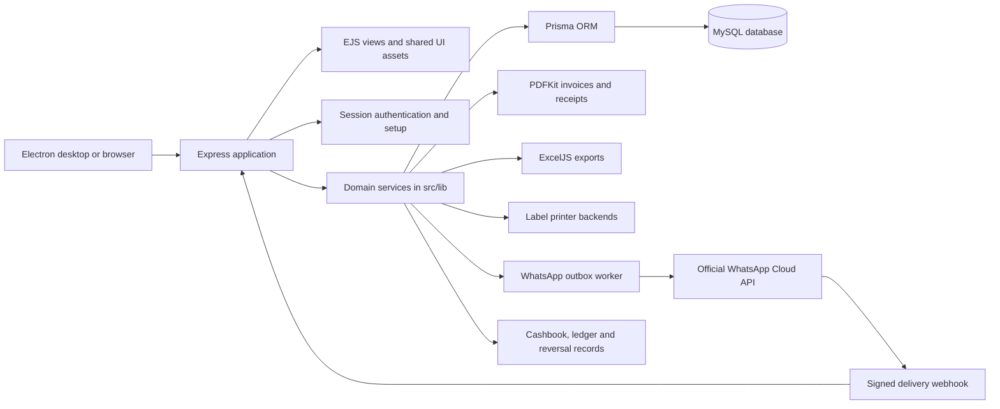

# Kusum Jewelers ERP

Lightweight local ERP for jewellery inventory, daily gold and silver rates, barcode billing, customer credit, cashbook, URD purchases, exports and archive management.

## Portfolio snapshot

Kusum Jewelers ERP is a production-minded desktop and local-network business application built with Node.js, Express, EJS, Prisma and MySQL, packaged with Electron for Windows and Debian-based Linux. It covers the full shop workflow: rate management, jewellery inventory, barcode billing, customer ledgers, sales PDFs, cashbook, schemes, URD purchases, Excel exports, printer integration and an opt-in WhatsApp sales-invoice delivery worker.

The repository includes a reproducible, sanitized portfolio invoice. It uses realistic demonstration rates and the requested sample customer profile; it does not contain shop database exports, WhatsApp tokens or production credentials.

- [Open the sample sales invoice PDF](docs/portfolio/assets/Kusum-ERP-demo-sales-invoice.pdf)
- [Read the portfolio architecture](docs/portfolio/architecture.md)
- [Review the demo fixture and rate assumptions](docs/portfolio/demo-sale.cjs)
- [Set up a disposable demo login](docs/portfolio/demo-login.md)
- [Review the illustrative rate card](docs/portfolio/rate-card.md)
- [Use the 90-second demo walkthrough](docs/portfolio/demo-walkthrough.md)

### Recruiter quick-start

```bash
npm install
npm run db:generate
npm run portfolio:pdf
```

The last command regenerates the sample invoice into `docs/portfolio/assets/` without connecting to a database. For a full local run, use the MySQL setup below, copy `.env.example` to `.env`, run migrations and start the Express server.

### Resume-ready summary

> Built and packaged a full-stack jewellery ERP with Electron, Express, Prisma and MySQL, including inventory and barcode billing, GST-aware sales invoicing, customer ledgers, cashbook reconciliation, Excel exports, native label printing and an opt-in WhatsApp Cloud API worker for sales invoice PDFs.

### Portfolio validation

The portfolio sample is generated by the same PDF module used by the ERP. The fixture is intentionally isolated from the shop database, and the generated document is checked as a valid PDF and rendered for visual review before being included here. Production WhatsApp credentials remain environment-only and are never committed.

## Architecture at a glance



### What happens during a sale

1. The authenticated sales form validates customer, product, rate, weight, making and payment inputs.
2. A Prisma transaction writes the sale, item snapshots, inventory movement, customer ledger and cashbook entries together.
3. The completed invoice can be rendered as a PDF, printed, exported or downloaded.
4. If WhatsApp is explicitly enabled and the customer has opted in, the outbox worker sends only that sales invoice PDF and stores delivery status.
5. Signed webhook events update delivery state without changing the original sale totals.

### Code ownership map

| Area | Location | Responsibility |
| --- | --- | --- |
| HTTP and pages | `src/server.js` | Routes, auth, transactions, exports and rendering |
| Domain services | `src/lib/` | PDF, WhatsApp, accounting, rates, printers and provisioning |
| Data model | `prisma/schema.prisma` | MySQL entities, enums and relations |
| Schema history | `prisma/migrations/` | Repeatable database upgrades |
| UI | `src/views/`, `public/` | EJS screens, styles and browser behavior |
| Desktop shell | `electron-main.js` | Starts and packages the same local server |

For the expanded component diagram and boundary notes, see [docs/portfolio/architecture.md](docs/portfolio/architecture.md).

## Capability map

| Capability | What the ERP demonstrates |
| --- | --- |
| Inventory | Jewellery master data, barcode/SKU snapshots, purity, HUID, gross/net weight and stock movements |
| Rates and pricing | Daily gold/silver rates, metal-rate snapshots, fixed/per-gram/percentage making charges and GST calculation |
| Billing | Customer lookup, walk-in customers, mixed payments, discounts, URD adjustment, balance/refund handling and invoice history |
| Finance | Customer ledger, cashbook entries, payment-method splits, reversal-safe cancellations and exports |
| Documents | Sales invoices, scheme receipts, customer-order documents, QR payloads and Excel reports |
| Operations | Main/client LAN setup, MySQL provisioning, printer transports, Electron packaging and Debian/Windows release scripts |
| Messaging | One deliberate automation path: an opted-in sales invoice PDF sent through the official WhatsApp Cloud API |

## Important design decisions

- **One source of truth:** the MySQL database stores inventory, sales, ledger, cashbook and business settings; client PCs connect to the same main-PC database instead of copying data.
- **Transaction-first billing:** inventory, sale items, payment totals, ledger and cashbook updates are committed together so a completed bill cannot silently diverge from stock or accounts.
- **Snapshot-based history:** sale lines preserve product name, barcode, metal, purity, HSN/HUID, weights and rates at the time of billing, even if the catalogue item changes later.
- **Safe integrations:** WhatsApp is opt-in and environment-configured; provider errors are recorded without undoing a successful sale. Printer support is transport-based rather than brand-based.
- **Desktop reuse:** Electron starts the same local Express application used during browser development, keeping business rules consistent across local web and packaged desktop use.

## Portfolio deployment notes

For a recruiter-facing deployment, use a disposable database and seeded sample data. Keep the live demo read-only or clearly labelled as a demo, disable WhatsApp sending, and do not expose shop exports, customer history, database passwords or provider tokens. The repository's portfolio fixture and PDF generator are database-free so a reviewer can inspect the document workflow without setting up the shop database first.

## Shop PC portable package

Use the generated `Kusum ERP-win32-x64` folder on the shop PC. Copy the entire folder and run `Kusum ERP.exe`; do not copy only the EXE. On first start, the ERP opens its one-time setup page. It uses the local MySQL administrator password only for setup, creates or upgrades the selected ERP database, applies the bundled schema migrations, and creates the limited shared ERP database account. The MySQL administrator password is never saved.

Before first use, install and start **MySQL Server** on the main database PC. For barcode labels, install the driver for the shop's compatible thermal label printer and select its exact Windows printer queue in the ERP. To update an installation, close the ERP and replace the entire old application folder; do not delete the MySQL database or `%LOCALAPPDATA%\Kusum Jewelers ERP` configuration folder.

## Linux desktop package

The first Linux target is Ubuntu/Debian 64-bit. On a Linux build host, run `npm install`, `npm run db:generate`, then `npm run package:linux`. The command creates a fresh `Kusum ERP-linux-x64` folder under `output/`. Copy the entire folder and run `./Kusum ERP`; Node.js is not required on the shop PC.

Install MySQL Server on the main database PC and CUPS for USB or shared printers. In ERP printer setup, choose **CUPS printer / USB** and enter the exact CUPS queue name, or choose **Direct TCP / Ethernet** for a network TSPL printer. The Linux package uses the same database, migrations, PDFs, Excel exports, barcodes and LAN setup as the Windows package.

To create a Debian/Ubuntu installer, run `npm run package:linux:deb`. It creates a fresh `kusum-erp_<version>_amd64.deb` installer under `output/`. Install it on Ubuntu/Debian with `sudo apt install ./kusum-erp_<version>_amd64.deb`; the application is installed under `/opt/kusum-erp` and a desktop-menu shortcut is added.

## Local setup

1. Create a MySQL database named `kusum_erp`.
2. Copy `.env.example` to `.env` and enter the local database and login settings.
3. Install packages with `npm install`.
4. Run `npm run db:generate`, then `npm run db:migrate`.
5. Start the app with `npm start` and open `http://localhost:3000`.

## Shared main PC / client PC setup

There is one database, normally named `kusum_erp`, on the main database PC. It contains all sales, stock, customers, cashbook records and settings. Every client PC connects to that same database; a client PC does **not** create or copy a second database.

1. On the main PC, install MySQL Server and run the ERP. Choose **Main database PC**, use `localhost`, and record the database name, port, shared ERP database username and password that you choose.
2. In ERP on the main PC open **Network PCs**. Use a shown LAN IP address; allow that MySQL port through Windows Firewall only for the Private shop network / local subnet. Do not expose MySQL to the internet.
3. On every client PC, run ERP and choose **Client PC**. Enter the main PC's LAN IP, the same MySQL port, same database name, and the same shared ERP database username and password. Do not use `localhost` on a client PC.
4. The ERP login (`kusum` by default) is separate from the MySQL shared ERP database username. The MySQL root account is only for main-PC setup and is not entered on client PCs.

If the saved details are stale—for example MySQL was reinstalled on a new port—the ERP opens **Repair ERP connection**. Save the current settings there; it changes only that PC's local connection settings and never deletes the shared database.

## Thermal barcode label printing

Barcode labels are sent as native raw printer commands - never as PDF labels. The included `GOLD.PRN` and `SILVER.PRN` templates use TSPL-compatible syntax and can be replaced or adjusted for the label stock and command language used by the shop's printer.

In **Barcode printer**, choose the transport for each PC:

- **Windows printer / USB** (recommended): sends a RAW label job through the Windows spooler. It works with a directly connected USB printer, a Windows shared printer, or a printer installed with a Windows Standard TCP/IP port.
- **CUPS / USB**: sends the same label job through the selected Linux CUPS queue.
- **Direct TCP / Ethernet**: opens a TCP connection to the configured printer or print-server IP. Use this when the printer or print server exposes a reachable raw-print port; a router alone cannot add Ethernet capability to a USB-only printer.

The existing printer environment keys remain compatible with current installations; see `.env.example` for the exact names. The queue name and transport are not tied to a particular printer brand. Use **Recheck printer** to test the selected Windows/CUPS queue or TCP connection, then use the printer test control to send a real test label. A successful spooler result proves the operating system accepted the raw bytes; a successful TCP result proves the network endpoint accepted them. Confirm the final physical label at the printer.

## Security

Do not commit `.env`, database backups, exports, or temporary work files. Configure credentials locally through environment variables.

## Sales invoice PDF WhatsApp automation

The ERP supports only one WhatsApp automation: sending a completed sales invoice PDF. It does not automate reports, purchases, schemes, reminders or marketing messages.

Configure an official WhatsApp Business Cloud API number and an approved utility template with a document header. Add the credentials locally to `.env` (never to source control):

```env
WHATSAPP_ENABLED=true
WHATSAPP_ACCESS_TOKEN=...
WHATSAPP_PHONE_NUMBER_ID=...
WHATSAPP_TEMPLATE_NAME=invoice_ready
WHATSAPP_TEMPLATE_LANGUAGE=en
WHATSAPP_GRAPH_API_VERSION=v23.0
WHATSAPP_WEBHOOK_VERIFY_TOKEN=...
WHATSAPP_APP_SECRET=...
```

The template body must accept three text values: customer name, invoice number and total amount. The customer must have a valid mobile number and explicit WhatsApp opt-in. Enable **Automatically send the sales PDF after a sale is saved** in Business settings. The ERP queues the PDF after the sale transaction commits, sends it through the API worker, and records only the delivery status and provider error metadata. If the provider reports a billing problem, the message is paused without blocking the sale; the PDF remains available for manual download. The webhook URL is `/webhooks/whatsapp` and must be reachable over HTTPS from Meta.
