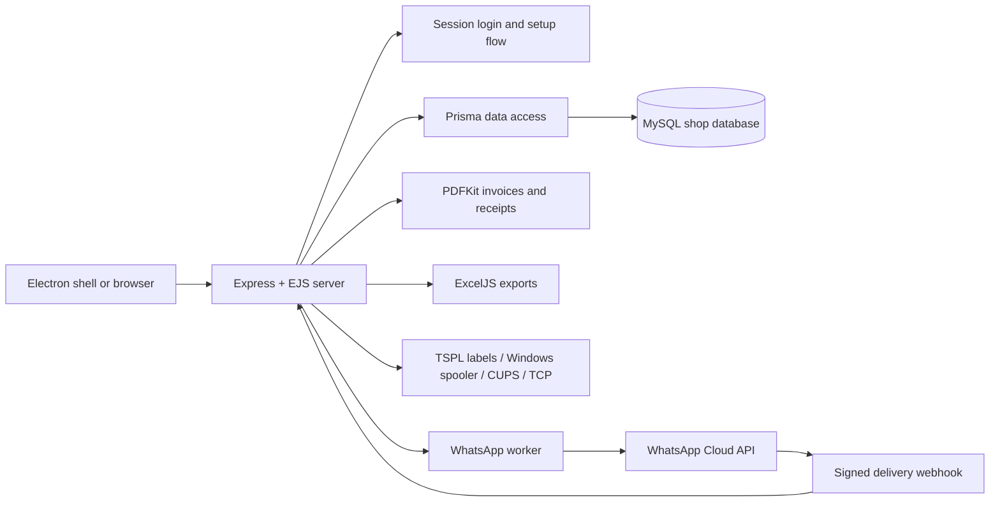

# Kusum Jewelers ERP - portfolio architecture

## Runtime shape

## Core boundaries

- `src/server.js` owns HTTP routes, authentication, transactions and page rendering.
- `src/lib/` contains business modules: accounting reversals, PDF generation, WhatsApp queueing, printer backends, rate calculations and shop provisioning.
- `prisma/schema.prisma` and `prisma/migrations/` define the relational model and repeatable schema upgrades.
- `src/views/` contains the server-rendered ERP screens; `public/` contains the shared UI assets.
- `electron-main.js` packages the same local server into a desktop application without creating a second business logic stack.

## Sales PDF and WhatsApp boundary

The ERP generates the sales invoice PDF first. Only when WhatsApp is explicitly enabled, the customer has opted in, and a valid phone number exists does the worker queue that PDF for the official Meta Cloud API. The worker records delivery state and provider errors; it does not block a completed sale. The webhook updates delivery state after Meta acknowledges the message.

## Demo safety

The portfolio fixture is deterministic and database-free. It uses sample gold and silver rates, a sample customer profile supplied for the portfolio, and no real shop transaction history. Keep `.env`, MySQL backups, private shop exports and WhatsApp secrets outside Git; the dummy documents in `docs/portfolio/assets/` are intentionally tracked for demonstration.
